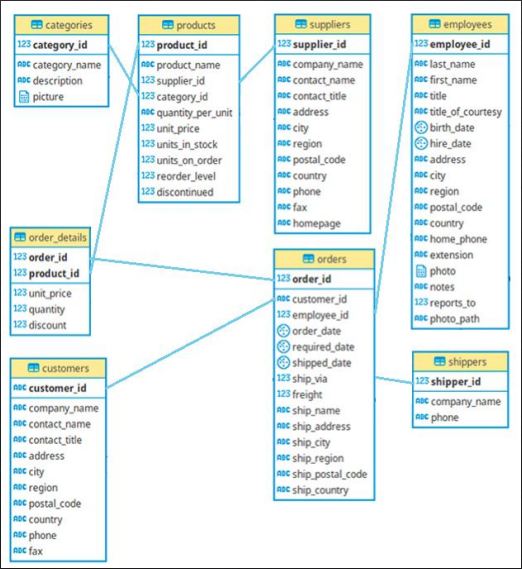
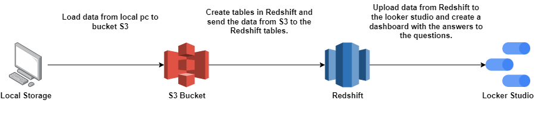

# Project 01 - Datawarehouse Northwind

> Resolução de problemas empresariais utilizando AWS Cloud desde o armazenamento local, até à visualização no painel de controlo.

## Objetivo:

> Responder perguntas de negócios a parte de requisições e problemas de uma empresa fictícia,
utilizando o banco de dados da empresa.

Relacional DB Schema:

## Preparação do Ambiente de Trabalho

> Abaixo estara o passo a passo desde a preparação do ambiente até a criação das tabelas no
Database:

 - Criação do Cluster no AWS Redshift.
 - Criação do Datawarehouse Northwind.
 - Upload dos arquivos .csv do PC Local para o bucket na AWS S3.
 - Criação das tabelas respectiva a cada arquivo .csv no bucket.
 - Utilizar o script de [**Copy**](https://github.com/ElcomJ/Data_Engineer_Project_01/blob/master/Copy_Script.txt) para inserir os dados do S3 nas tabelas do Northwind.
 - Realizar uma Querie de teste para saber se os dados foram inseridos corretamente.
 - Criar tabelas com os resultados da perguntas de negócios.
 - Cria dashboards no [**Looker Studio**](https://datastudio.google.com/) com os resultados.

## Atividades:

 1. Gerar um relatório com os valores tabelados dos produtos e com os valores realmente
executados nas vendas, exibindo a diferença entre esses valores e exibir a quantidade de
produtos vendidos por venda.

2. Agrupar o valor das vendas dos vendedores no ano de 2022 para analisar o desempenho do
vendedor "Robert King".

3. Selecionar os 10 produtos que têm os preços tabelados mais caros.

4. Mostrar a quantidade de vendas total por fornecedor nos anos de 2021 e 2020 e a
diferença entre o total de vendas desses anos.

5. Selecionar as 5 categorias que mais venderam em cada ano.

## Arquivos de Resposta:

> Os scripts de cada atividade podem ser encontrado
[Aqui](https://github.com/ElcomJ/Data_Engineer_Project_01/tree/master/Scripts)
